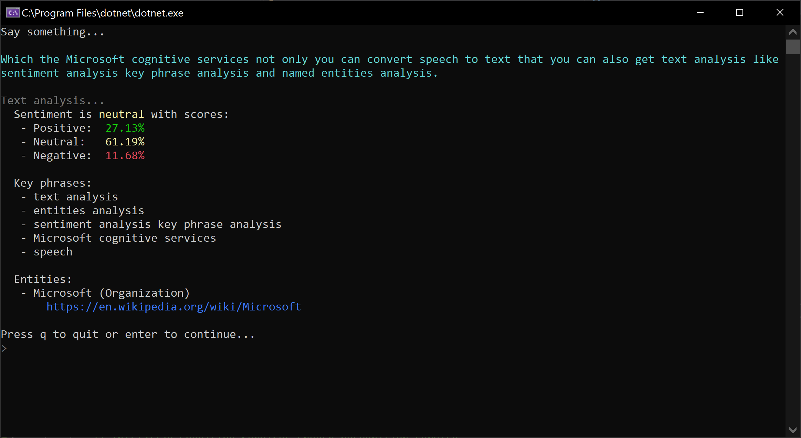
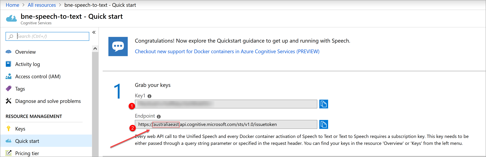

# Microsoft Cognitive Services Demo for Customer Support

This is created to show a proof of concept for customer support using Microsoft Cognitive Service.

## Scenario

Imagine we have thousands of hours of recordings of customer service and what we want to achieve is the following:

* Convert speech to text
* Get text sentiment
* Get key phrases
* Ideally add additional context like persons, corporations, etc.

## What the demo covers

We use Microsoft Cognitive Services to convert speech to text and do some text analysis to get some extra context out of text.

The app will listen for your input and will start analyzing as soon as it detect a bit longer pause.

**Figure: Demonstration of the app.**

## Prerequisites

Create following Cognitive Services in Azure Portal:

* Cognitive Services Speech
* Cognitive Services Text Analysis

 

Copy the values from Speech and Text Analysis into the variables in `Programs.cs`.

**Figure: Copy value from Azure Portal.**

## Run application

Just press F5 in Visual Studio or `dotnet run` in **CognitiveServicesDemo.CustomerSupport** folder.
